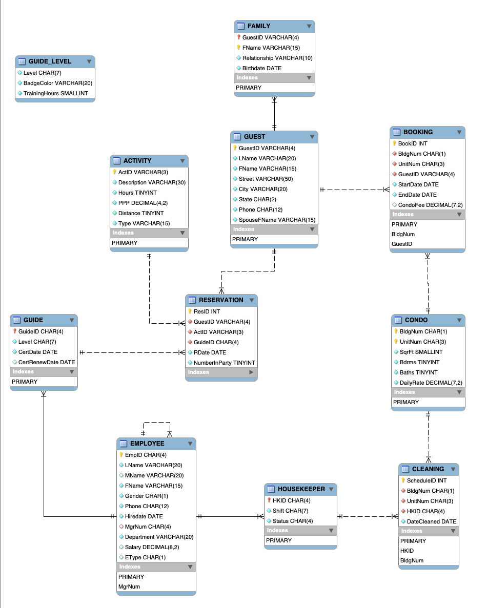

# Vina Resort Management System

## Overview
Vina Resort Management System is a comprehensive database management solution tailored for the operations of Vina Resort. It encompasses various functionalities essential for efficient resort management, including guest reservations, employee management, activity scheduling, and reporting. This system aims to streamline resort operations, enhance guest experience, and optimize resource utilization.

## Features
- **Reservation Management:** Facilitates the creation, modification, and cancellation of guest reservations with ease and efficiency.
- **Employee Management:** Provides tools for managing employee information, including hiring, scheduling, performance tracking, and payroll management.
- **Activity Scheduling:** Enables efficient scheduling and management of resort activities such as tours, recreational activities, and events.
- **Reporting:** Generates insightful reports on various aspects of resort operations, including reservation statistics, employee performance, revenue analysis, and more.

## Database Schema
Below is the database schema for the Vina Resort Management System:

### Tables
1. **RESERVATION:** Stores information about guest reservations, including reservation ID, guest ID, activity ID, reservation date, and number of guests.
2. **EMPLOYEE:** Contains details about resort employees, including employee ID, name, hire date, status, department, salary, and more.
3. **ACTIVITY:** Stores information about resort activities, including activity ID, description, duration, price per person, and type.
4. **GUEST:** Stores guest information, including guest ID, name, address, contact details, and spouse's name.
5. **FAMILY:** Contains information about guest family members, including guest ID, family member name, relationship, and birthdate.
6. **BOOKING:** Stores details of guest bookings, including booking ID, guest ID, unit number, start date, end date, and condo fee.
7. **CONDO:** Contains information about resort condominiums, including unit number, building number, square footage, number of bedrooms, number of baths, and daily rental rate.
8. **CLEANING:** Tracks cleaning schedules for resort condos, including schedule ID, building number, unit number, housekeeper ID, and cleaning date.
9. **GUIDE:** Stores details of resort guides, including guide ID, name, certification date, certification renewal date, and level.
10. **GUIDE_LEVEL:** Contains information about guide certification levels, including level, badge color, and required training hours.

## Installation
1. Clone the repository to your local machine.
2. Import the provided SQL script to create and populate the database schema.
3. Update the database connection settings in the application configuration file.
4. Run the application to start using the Vina Resort Management System.

## Usage
- **Reservation Management:** Utilize the reservation management module to handle guest reservations, modifications, and cancellations efficiently.
- **Employee Management:** Access the employee management module to manage employee details, schedules, and payroll.
- **Activity Scheduling:** Schedule and manage resort activities through the activity scheduling module.
- **Reporting:** Generate insightful reports to analyze resort performance, track key metrics, and make informed decisions.

## Contributors
Contributions are welcome! If you find any issues or have suggestions for improvement, please open an issue or submit a pull request.
